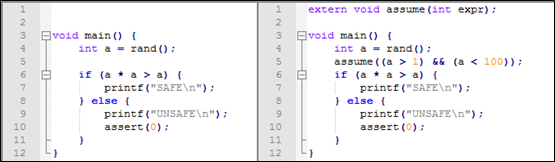

约束是指在程序运行到某个位置时，包含一个或多个变量的布尔表达式取值为真。对于待验证的C程序，如果需要假设变量的取值在运行到某个位置时满足某些条件，则可以在该位置插入一条约束。

Ceagle使用C语言的方式声明约束。如果要使用约束功能，请在待验证的C程序中插入一个返回值为空、参数仅包含一个int类型参数的外部函数声明，并在Ceagle中将约束声明函数名称设定为该函数名。当需要插入约束时，按照C语言的方式构建布尔表达式并以此为参数调用约束声明函数。Ceagle会自动识别这些函数调用并建立约束。

**注意！**由于C语言没有bool类型，构建出的布尔表达式的值实际上是一个取值为0或1的int类型，对应的约束为表达式值等于1。

下图给出了一个使用约束的例子，在Ceagle中设定约束声明函数为assume后，Ceagle会识别出在程序第5行插入的约束。

应用约束的场合，如果属性不成立，那么一定存在一条程序执行路径，其上所有的约束描述的变量取值条件都满足，并且这条路径会导致属性不成立；反之，如果属性成立，那么不存在这样一条程序执行路径。在上面的例子中，使用约束前安全属性不成立，但使用后安全属性成立。