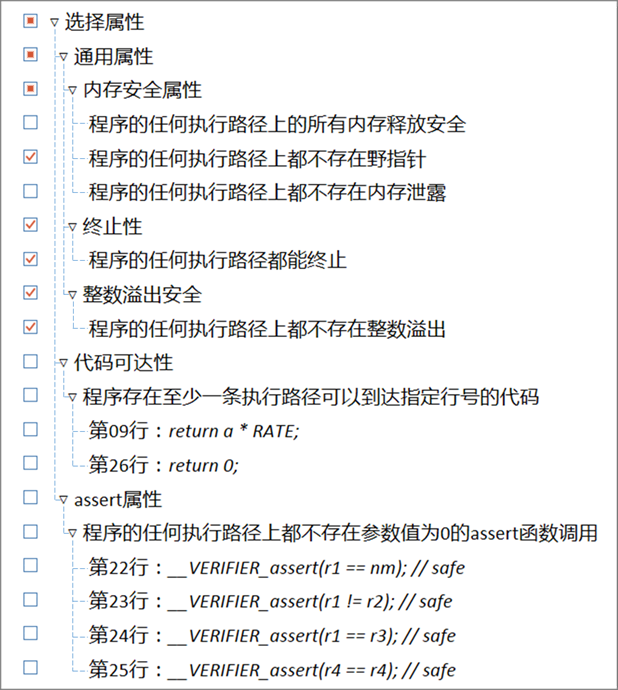

Ceagle支持验证内存安全和程序终止性两类通用属性。

内存安全属性要求程序中不存在：无效的内存释放；指针访问越界；没有指针指向但未释放的内存。

程序终止性属性要求程序中不存在一条无限长度的执行路径。

## 网页版

使用网页版的属性选择面板进行属性选择：



## 命令行版

```
# 验证foo.c中的内存释放操作是否安全
ceagle --property.memory.free foo.c

# 验证foo.c中的内存解引用操作是否安全
ceagle --property.memory.deref foo.c

# 验证foo.c中的内存是否有泄漏
ceagle --property.memory.memtrack foo.c

# 验证foo.c中所有三条内存属性
ceagle --property.memory foo.c

# 验证foo.c是否可终止
ceagle --property.termination foo.c

# 验证foo.c是否有整数溢出
ceagle --property.overflow foo.c

# 属性可以指定多个
# 同时验证内存释放和内存解引用
ceagle --property.memory.free --property.memory.deref foo.c
```
