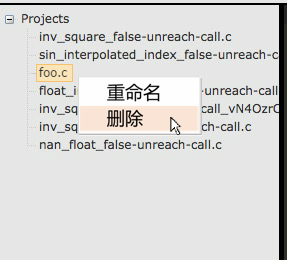

# 代码文件的新建、删除和重命名
* 在左侧项目列表中，右键点击，可以在弹出的选项栏中，选择进行以下操作
	* 新建：在空白处右键点击，然后在弹出的选项栏中选择**新建**，可以新建一个代码文件
	
		

	* 删除：选择某个项目并右键点击，然后在弹出的选项栏中选择**重命名**，可以重命名一个代码文件
	
		
	
	* 重命名：选择某个项目并右键点击，然后在弹出的选项栏中选择**删除**，可以删除一个代码文件
	
		