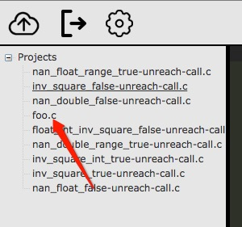

# 网页版－验证操作

添加属性

* 在左侧项目导航中，点击某一代码文件
* 文件内容将以可编辑的方式，出现在页面中部的代码池中
* 在右侧属性选择栏中，系统自动扫描出代码中的属性
* 点击每条属性，页面中部的代码池，随即将光标定位到对应位置

	

进行验证

* 在右侧属性选择栏中，点击某一属性最右侧的验证按钮
* 系统将根据用户选择的属性，对项目代码进行验证
* 在中部日志栏中，系统将给出验证过程中的系统日志，可供查看
* 在右侧反例路径栏中，系统将给出验证属性的反例路径，可供查看

	