#网页版

###注册账号
* 打开网页浏览器
* 访问Ceagle网页版页面：[http://sts.thss.tsinghua.edu.cn/ceagle/online/](http://sts.thss.tsinghua.edu.cn/ceagle/online/)

	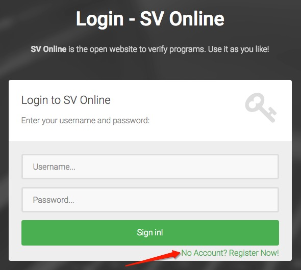

* 如果您已经拥有账号，可以跳过此步，直接登录
* 点击“No Account? Register Now!”，进入注册页面进行注册
* 输入用户名和密码，完成注册

	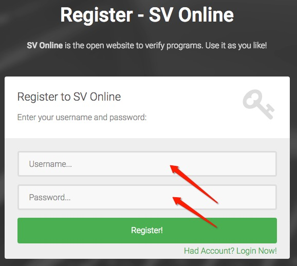

* 注册成功后，直接跳转到主页面

	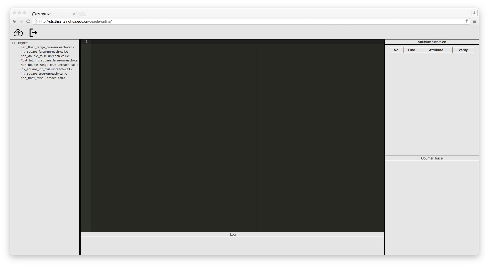

###上传代码
* 点击页面左上角的上传按钮

	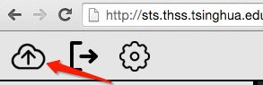

* 选择代码文件，并点击“Upload”

	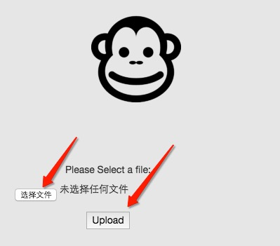

* 完成上传后，新上传的代码文件出现在左侧的项目列表中

	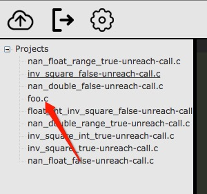

###打开文件
* 在左侧的项目列表中，点击刚刚上传的foo.c
* 在中间的代码池中出现了我们上传的代码
* 可以对代码进行编辑

	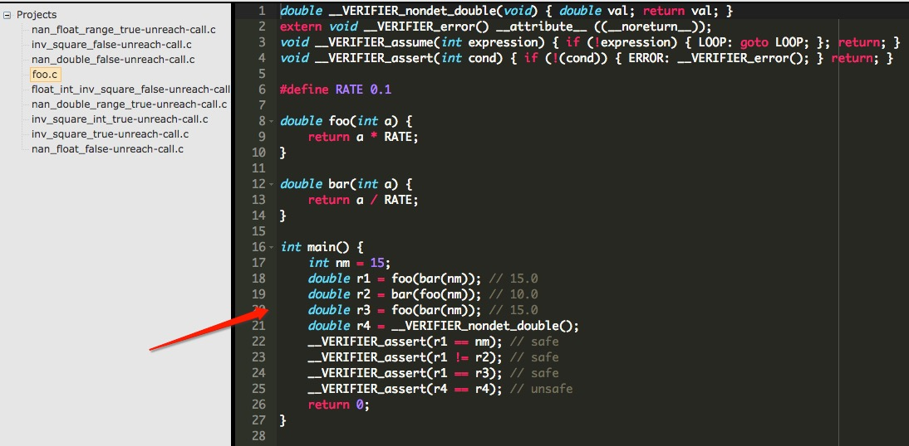

###点击验证
* 在上一步打开文件之后，右侧的“Attribute Selection”栏中出现了该项目中的验证属性

	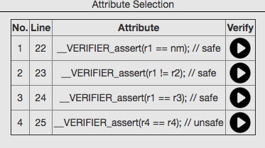

* 点击验证按钮，可以对该项目进行验证操作

	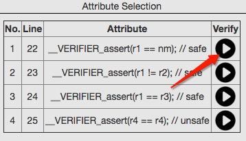

###查看结果

* 在上一步点击验证之后，网页版Ceagle验证工具给出了验证结果
* 在页面下方的“Log”栏中给出了验证结果（True/False）

	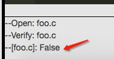

* 在页面右下方的“Counter Trace”栏中给出了验证错误的反例路径

	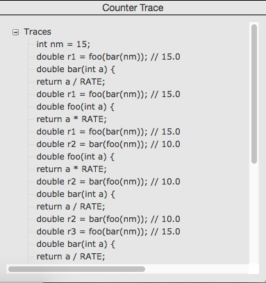
